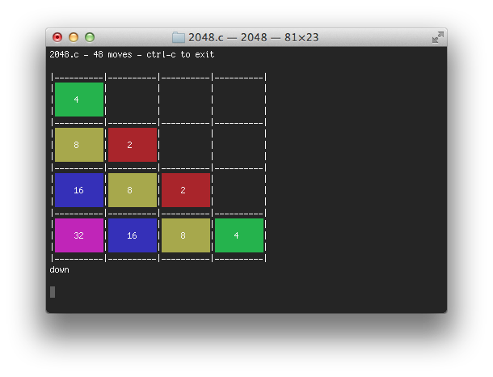

bash 2048
=========

My take at http://gabrielecirulli.github.io/2048/ in C

Usage
-----

    make
    ./2048

Run with `-a` for awesome animations

    Usage: 2048 [-a] [-b] [-h] [-g <goal>]

    Options
      -a          enable animations
      -b          disable color output; b for boring!
      -g <goal>   the goal piece, defaults to 2048
      -h          print this message and exit

License
-------

MIT License
